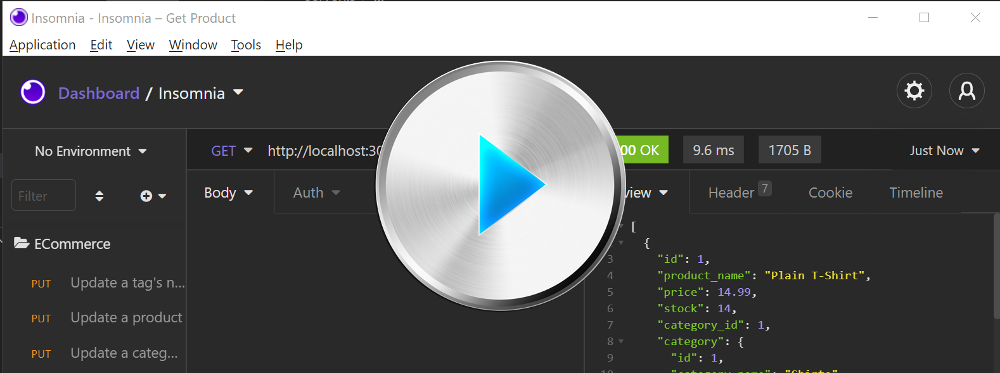

# ECommerce
This challenge for Module 13 of the Coding Bootcamp is to write the back end of an e-commerce site.

* [User Story](#userStory)

* [Requirements](#requirements)

* [Technologies Used](#techUsed)

* [What I Learned](#whatILearned)

* [ECommerce Screenshot](#webImage)

* [ECommerce Demo](#projectDemo)

* [ECommerce URL](#projectURL) - I think the project does NOT get deployed to HEROKU, so we don't need this

* [Contact Me](#contactMe)

---

## User Story
AS A manager at an internet retail company
I WANT a back end for my e-commerce website that uses the latest technologies
SO THAT my company can compete with other e-commerce companies
--- 

## Requirements
* Build a command line application
* Use the supplied express.js API
* Connect to the database using Sequelize using the datdabase name, MySQL username, and MySQL and password from an environment variable file
* The user can enter schema and seed commands to create the database and seed it with test data
* When the application is started from the command line, the server is started and the Sequelize models are synced to the MySQL database
* Opening API GET routes in Insomnia core for categories, products, or tags will display the data for each of those routes in formatted JSON
* The user can test API POST, PUT, and DELETE routes via Insomnia Core to create, update, and delete data in the database
* Use the MySQL2 and Sequelize packages to connect your Express.js API to a MySQL database
* Use the dotenv package to use environment variables to store sensitive data, like your MySQL username, password, and database name.
* Use the schema.sql file in the db folder to create the database using MySQL shell commands.
* The database should contain the following four models:
    * Category
        * id
            * Integer
            * Doesn't allow null values
            * Set as primary key
            * Uses auto increment
        * category_name
            * String
            * Doesn't allow null values
    * Product
        * id
            * Integer
            * Doesn't allow null values
            * Set as primary key
            * Uses auto increment
        * product_name
            * String
            * Doesn't allow null values
        * price
            * Decimal
            * Doesn't allow null values
            * Validates that the value is a decimal
        * stock
            * Integer
            * Doesn't allow null values
            * Set a default value of 10
            * Validates that the value is numeric
        * category_id
            * Integer
            * References the category model's id
    * Tag
        * id
            * Integer
            * Doesn't allow null values
            * Set as primary key
            * Uses auto increment
        * tag_name
            * String
    * ProductTag
        * id
            * Integer
            * Doesn't allow null values
            * Set as primary key
            * Uses auto increment
        * product_id
            * Integer
            * References the product model's id
        * tag_id
            * Integer
            * References the tag model's id
* The models need to have the following relationships:
    * Product belongs to Category, as a category can have multiple products but a product can only belong to one category.
    * Category has many Product models.
    * Product belongs to many Tag models. Using the ProductTag through model, allow products to have multiple tags and tags to have many products.
    * Tag belongs to many Product models.
* Fill Out the API Routes to Perform RESTful CRUD Operations in the following files:
    * product-routes.js
    * tag-routes.js
    * category-routes.js
* After creating the models and routes, run npm run seed to seed data to the database and then test the new routes.
* Create the code needed in server.js to sync the Sequelize models to the MySQL database on server start.

---

## Technologies Used
* Node.js
* Sequelize
* MySql2.0
* dotenv

--- 

## What I Learned

---

## ECommerce Screenshot

---

## ECommerce Demo

---

## Contact Me
You can reach me, Brenda Jackels, at bjackels5@gmail.com.